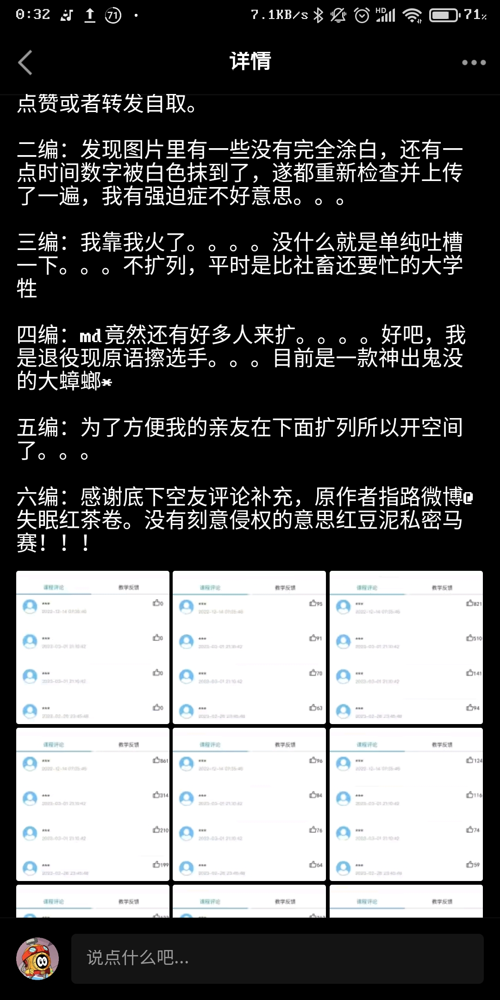
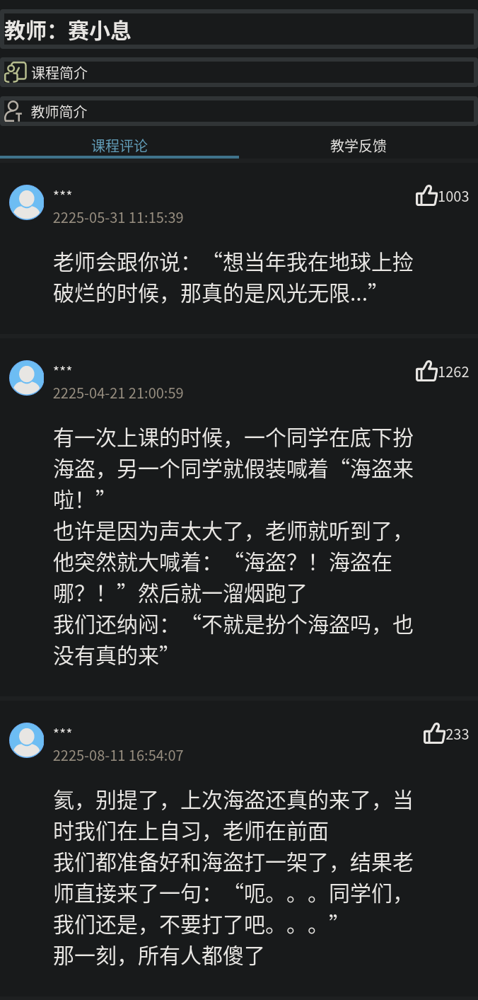

# 玩一玩
灵感来源：

~~P 图什么的都弱爆了，我们直接用 HTML~~

想让谁当你的老师？
想对他说些什么？
送给他一个 HTML 祝福吧！

## 用法
复制 <\!-- 模板 ... --> 里面代码的内容（就是 <section\> 一堆），替换掉用户名、内容什么的，就 OK 菈

教师，简介等也可以改，只需要修改相应位置的文字即可

（只是放学以后两个小时的成果，而且我是个前端垃圾，效果也就那样了，如果有大佬看了我的代码的话请轻喷🙏️🙏️🙏️🙏️）

（等我有时间的做一个比较友好的版本）

## 例子
（我实在是没什么可说的了。。。）

